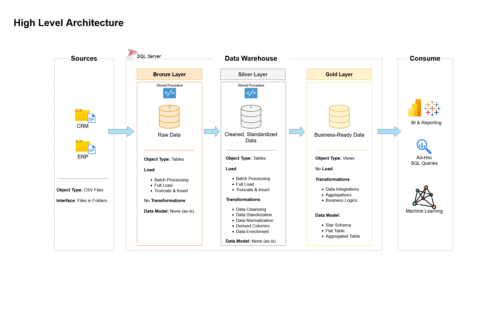

# 🏢 SQL Data Warehouse Project

<div align="center">


**Building a modern Data Warehouse with MySQL, including ETL processes, Data Modeling and Analytics**

[📖 Documentation](#-documentation) • [🚀 Getting Started](#-getting-started) • [💡 Features](#-key-features) • [🛠️ Tools](#%EF%B8%8F-tools--technologies)

</div>

---

## 📋 Table of Contents

- [🎯 Project Overview](#-project-overview)
- [✨ Key Features](#-key-features)
- [🏗️ Data Architecture](#%EF%B8%8F-data-architecture)
- [🛠️ Tools & Technologies](#%EF%B8%8F-tools--technologies)
- [🚀 Getting Started](#-getting-started)
- [📂 Project Structure](#-project-structure)
- [📊 Business Requirements](#-business-requirements)
- [📖 Documentation](#-documentation)
- [🧪 Testing](#-testing)
- [🤝 Contributing](#-contributing)
- [📄 License](#-license)
- [👨‍💻 About the Author](#-about-the-author)

---

## 🎯 Project Overview

This project demonstrates a **production-ready data warehouse solution** that transforms raw business data into actionable insights. Built using industry best practices, it serves as a comprehensive portfolio piece showcasing expertise in modern data engineering and analytics.

### 🎪 What Makes This Project Special?

- **🏛️ Medallion Architecture**: Implements Bronze, Silver, and Gold layers for optimal data processing
- **📈 Real Business Impact**: Solves actual business problems with customer behavior and sales analytics
- **🔄 Complete ETL Pipeline**: From raw CSV files to analytical insights
- **📊 Star Schema Design**: Optimized for high-performance analytical queries
- **📚 Comprehensive Documentation**: Every aspect is well-documented for learning and implementation

---

## ✨ Key Features

<table>
<tr>
<td width="100%">

### 🏗️ **Data Engineering**
- ✅ Modern Medallion Architecture
- ✅ Automated ETL Pipelines
- ✅ Data Quality Validation
- ✅ Error Handling & Logging
- ✅ Incremental Data Processing
- ✅ Star Schema Data Modeling
</td>
</tr>
</table>

---

## 🏗️ Data Architecture

The data architecture for this project follows Medallion Architecture **Bronze**, **Silver**, and **Gold** layers:



| Layer | Purpose | Technologies |
|-------|---------|--------------|
| 🥉 **Bronze** | Raw data ingestion and storage | MySQL, Data Import |
| 🥈 **Silver** | Data cleansing and standardization | MySQL, Stored Procedures |
| 🥇 **Gold** | Business-ready analytical models | Star Schema, Views |

---

## 🛠️ Tools & Technologies

<div align="center">

### 💾 **Database & Storage**


### 🔧 **Development Tools**


### 📋 **Project Management**


</div>

### 🆓 **All Tools Are Free!**

| Tool | Purpose | Download Link |
|------|---------|---------------|
| **SQL Server Express** | Database Engine | [Download](https://www.microsoft.com/en-us/sql-server/sql-server-downloads) |
| **SSMS** | Database Management | [Download](https://learn.microsoft.com/en-us/sql/ssms/download-sql-server-management-studio-ssms?view=sql-server-ver16) |
| **Draw.io** | Architecture Diagrams | [Access Online](https://www.drawio.com/) |
| **Git** | Version Control | [Setup Guide](https://github.com/) |
| **Notion** | Project Organization | [Get Started](https://www.notion.com/) |

---

## 🚀 Getting Started

### 📋 Prerequisites

- Windows 10/11 or Windows Server
- SQL Server Express 2019+ 
- SQL Server Management Studio (SSMS)
- Git for version control

### ⚡ Quick Setup

1. **Clone the Repository**
   ```bash
   git clone https://github.com/thetorangi/sql-project.git
   cd sql-project
   ```

2. **Setup SQL Server**
   - Install SQL Server Express
   - Install SSMS
   - Create a new database instance

3. **Load Sample Data**
   ```sql
   -- Run bronze layer scripts
   EXEC scripts/bronze/dll_bronze.sql
   EXEC scripts/bronze/proc_bronze.sql
   ```

4. **Build the Warehouse**
   ```sql
   -- Execute silver and gold layer transformations
   EXEC scripts/silver/dll_silver.sql
   EXEC scripts/gold/proc_silver.sql
   ```

5. **Verify Setup**
   - Check data quality reports
   - Validate analytical queries
   - Review documentation

### 📖 **Detailed Setup Guide**
👉 **[Complete Project Walkthrough](#)**

---

## 📂 Project Structure

```
sql-project/
├── 📁 datasets/                    # Raw data sources (ERP & CRM)
│   ├──📁 source_crm
│   │   ├──cust_info.csv
│   │   ├──prd_info.csv
│   │   └──sales_details.csv
│   │
│   └──📁 source_crm
│       ├──cust_az12.csv
│       ├──loc_a101.csv
│       └──px_cat_g1v2.csv
│
├── 📁 docs/                        # Project documentation
│   ├── 🎨 data_architecture.drawio # Architecture diagrams
│   ├── 🔄 data_flow.drawio         # Data flow visualization
│   ├── 📊 data_models.drawio       # Star schema models
│   ├── 📋 data_catalog.md          # Data dictionary
│   └──🏷️ naming_conventions.md    # Coding standards
│
├── 📁 scripts/                     # SQL transformation scripts
│   ├── 🥉 bronze/                  # Raw data ingestion
│   │   ├── dll_bronze.sql
│   │   └── proc_bronze.sql
│   │
│   ├── 🥈 silver/                  # Data cleansing & standardization
│   │   ├── dll_silver.sql
│   │   └── proc_silver.sql
│   │
│   └── 🥇 gold/                    # Analytical models
│       └── dll_gold.sql
│
├── 📁 tests/                       # Data quality & validation
│   └── quality_check.sql
│
├── 📄 README.md
├── 📄 LICENSE
└── 📄 .gitignore
```

---

## 📊 Business Requirements

### 🎯 **Data Engineering Objectives**

<details>
<summary><strong>🏗️ Data Warehouse Development</strong></summary>

- **Data Sources**: Integrate ERP and CRM systems via CSV imports
- **Data Quality**: Implement comprehensive cleansing and validation
- **Architecture**: Modern medallion-based design for scalability
- **Performance**: Optimize for analytical query performance
- **Documentation**: Complete data lineage and business glossary

</details>

---

## 📖 Documentation

Our documentation is comprehensive and designed for both technical and business audiences:

| Document | Audience | Purpose |
|----------|----------|---------|
| [📋 Data Catalog](docs/data_catalog.md) | All Users | Complete data dictionary and metadata |
| [🏗️ Architecture Guide](docs/data_architecture.drawio) | Technical | System design and data flow |
| [📊 Data Models](docs/data_models.drawio) | Analysts | Star schema and relationships |
| [🏷️ Naming Conventions](docs/naming_conventions.md) | Developers | Coding standards and guidelines |
| [📝 Requirements](docs/requirements.md) | Business | Functional and technical specifications |

---

## 🧪 Testing

Quality assurance is built into every layer:

```sql
-- Example: Data Quality Check
SELECT 
    'Customer Data' AS test_category,
    COUNT(*) AS total_records,
    COUNT(DISTINCT customer_id) AS unique_customers,
    SUM(CASE WHEN email IS NULL THEN 1 ELSE 0 END) AS missing_emails
FROM silver.customers;
```

### Test Categories
- ✅ **Data Quality**: Completeness, accuracy, consistency
- ✅ **Business Rules**: Logic validation and constraints
- ✅ **Performance**: Query optimization and indexing
- ✅ **Integration**: End-to-end pipeline validation

---

## 🤝 Contributing

We welcome contributions from the community! Here's how you can help:

### 🌟 Ways to Contribute
- 🐛 **Bug Reports**: Found an issue? Let us know!
- 💡 **Feature Requests**: Have ideas for improvements?
- 📖 **Documentation**: Help improve our guides
- 🧪 **Testing**: Add test cases and validations

### 📝 Contribution Process
1. Fork the repository
2. Create a feature branch (`git checkout -b feature/amazing-feature`)
3. Commit your changes (`git commit -m 'Add amazing feature'`)
4. Push to the branch (`git push origin feature/amazing-feature`)
5. Open a Pull Request

---

## 📄 License

This project is licensed under the **MIT License** - see the [LICENSE](LICENSE) file for details.

```
MIT License - Feel free to use, modify, and share with proper attribution
```

---

## 👨‍💻 About the Author

<div align="center">

### **coderKarma⚡** 

*Passionate Data Engineering learner and student on a journey to master modern data warehousing and analytics!*


---

<div align="center">

### 🌟 **If this project helped you, please consider giving it a star!** ⭐

**Made with ❤️ for the Data Community**

*Last Updated: August 2025*

</div>