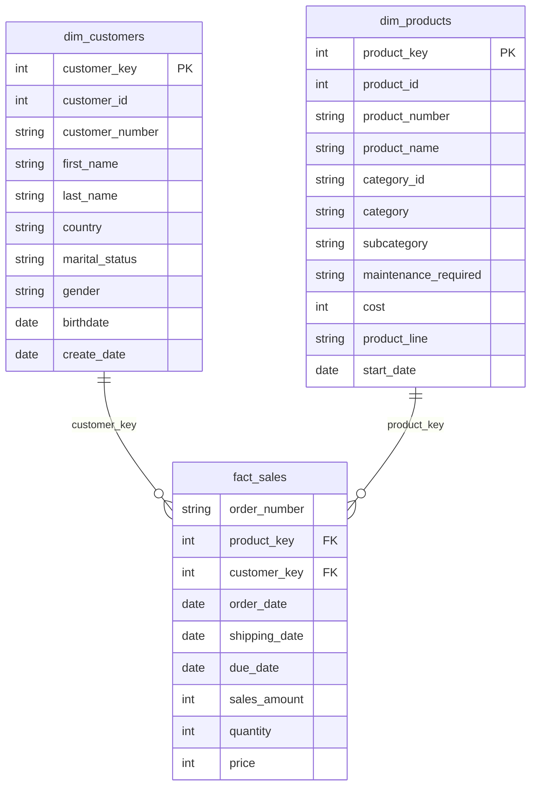

# 🏆 Gold Layer Data Catalog

> **Enterprise Data Warehouse** | Business-Ready Analytics Data Repository

---

## 📊 Overview

The **Gold Layer** represents the pinnacle of our data architecture, providing business-ready, analytically optimized data structures. This layer features carefully designed **dimension tables** and **fact tables** that support comprehensive reporting, advanced analytics, and business intelligence initiatives across the organization.

### 📈 Data Architecture Summary

| **Metric** | **Count** |
|------------|-----------|
| **Total Tables** | 3 |
| **Dimension Tables** | 2 |
| **Fact Tables** | 1 |
| **Total Columns** | 21 |

---

## 👥 **gold.dim_customers**

> **📍 Table Type:** `DIMENSION TABLE`  
> **🎯 Purpose:** Customer master data enriched with demographic and geographic attributes for comprehensive customer analytics

### Column Specifications

| **Column Name** | **Data Type** | **Description** |
|-----------------|---------------|-----------------|
| `customer_key` | `INT` | **🔑 Surrogate Key** - Uniquely identifies each customer record in the dimension table |
| `customer_id` | `INT` | Unique numerical identifier assigned to each customer |
| `customer_number` | `NVARCHAR(50)` | Alphanumeric identifier representing the customer, used for tracking and referencing |
| `first_name` | `NVARCHAR(50)` | The customer's first name, as recorded in the system |
| `last_name` | `NVARCHAR(50)` | The customer's last name or family name |
| `country` | `NVARCHAR(50)` | The country of residence for the customer (e.g., 'Australia') |
| `marital_status` | `NVARCHAR(50)` | The marital status of the customer (e.g., 'Married', 'Single') |
| `gender` | `NVARCHAR(50)` | The gender of the customer (e.g., 'Male', 'Female', 'n/a') |
| `birthdate` | `DATE` | The date of birth of the customer, formatted as YYYY-MM-DD (e.g., 1971-10-06) |
| `create_date` | `DATE` | The date when the customer record was created in the system |

### 🏷️ Key Attributes
- **Primary Key:** `customer_key` (Surrogate)
- **Natural Key:** `customer_id`
- **Record Count:** Variable (SCD Type 2 managed)

---

## 📦 **gold.dim_products**

> **📍 Table Type:** `DIMENSION TABLE`  
> **🎯 Purpose:** Comprehensive product catalog with detailed attributes for inventory management and sales analytics

### Column Specifications

| **Column Name** | **Data Type** | **Description** |
|-----------------|---------------|-----------------|
| `product_key` | `INT` | **🔑 Surrogate Key** - Uniquely identifies each product record in the product dimension table |
| `product_id` | `INT` | A unique identifier assigned to the product for internal tracking and referencing |
| `product_number` | `NVARCHAR(50)` | A structured alphanumeric code representing the product, used for categorization or inventory |
| `product_name` | `NVARCHAR(50)` | Descriptive name of the product, including key details such as type, color, and size |
| `category_id` | `NVARCHAR(50)` | A unique identifier for the product's category, linking to its high-level classification |
| `category` | `NVARCHAR(50)` | The broader classification of the product (e.g., Bikes, Components) to group related items |
| `subcategory` | `NVARCHAR(50)` | A more detailed classification of the product within the category, such as product type |
| `maintenance_required` | `NVARCHAR(50)` | Indicates whether the product requires maintenance (e.g., 'Yes', 'No') |
| `cost` | `INT` | The cost or base price of the product, measured in monetary units |
| `product_line` | `NVARCHAR(50)` | The specific product line or series to which the product belongs (e.g., Road, Mountain) |
| `start_date` | `DATE` | The date when the product became available for sale or use |

### 🏷️ Key Attributes
- **Primary Key:** `product_key` (Surrogate)
- **Natural Key:** `product_id`
- **Hierarchical Structure:** Category → Subcategory → Product Line

### 📊 Product Classification Hierarchy

```
📁 Category (e.g., Bikes)
  ├── 📂 Subcategory (e.g., Road Bikes)
  │   └── 🏷️ Product Line (e.g., Professional Series)
  │       └── 📦 Individual Products
```

---

## 💰 **gold.fact_sales**

> **📍 Table Type:** `FACT TABLE`  
> **🎯 Purpose:** Transactional sales data optimized for analytical queries and business performance reporting

### Column Specifications

| **Column Name** | **Data Type** | **Description** |
|-----------------|---------------|-----------------|
| `order_number` | `NVARCHAR(50)` | **🆔 Business Key** - Unique alphanumeric identifier for each sales order (e.g., 'SO54496') |
| `product_key` | `INT` | **🔗 Foreign Key** - Links to `gold.dim_products.product_key` |
| `customer_key` | `INT` | **🔗 Foreign Key** - Links to `gold.dim_customers.customer_key` |
| `order_date` | `DATE` | The date when the order was placed |
| `shipping_date` | `DATE` | The date when the order was shipped to the customer |
| `due_date` | `DATE` | The date when the order payment was due |
| `sales_amount` | `INT` | **💵 Measure** - Total monetary value of the sale for the line item, in whole currency units |
| `quantity` | `INT` | **📊 Measure** - Number of units of the product ordered for the line item |
| `price` | `INT` | **💲 Measure** - Price per unit of the product for the line item, in whole currency units |

### 🏷️ Key Attributes
- **Grain:** One record per order line item
- **Fact Type:** Transaction Fact Table
- **Measures:** `sales_amount`, `quantity`, `price`
- **Dimensions:** Customer, Product, Time (via dates)

### 🔄 Dimensional Relationships



---

## 📋 Data Quality Standards

### 🔍 Key Performance Indicators

| **Metric** | **Target** | **Description** |
|------------|------------|-----------------|
| **Data Completeness** | ≥ 95% | Percentage of non-null values in critical columns |
| **Data Accuracy** | ≥ 98% | Percentage of records passing validation rules |
| **Referential Integrity** | 100% | All foreign keys must have valid references |
| **Data Freshness** | Daily | Maximum acceptable data latency |

### 🛡️ Data Governance

- **Owner:** Data Engineering Team
- **Steward:** Business Intelligence Team
- **Classification:** Internal Use
- **Retention Policy:** 7 Years
- **Update Frequency:** Daily (ETL Process)

---

## 🔧 Usage Guidelines

### 📊 Analytical Patterns

**Customer Analysis**
```sql
-- Example: Customer segmentation analysis
SELECT 
    c.country,
    c.marital_status,
    COUNT(*) as customer_count,
    AVG(f.sales_amount) as avg_order_value
FROM gold.dim_customers c
JOIN gold.fact_sales f ON c.customer_key = f.customer_key
GROUP BY c.country, c.marital_status;
```

**Product Performance**
```sql
-- Example: Top performing products by category
SELECT 
    p.category,
    p.product_name,
    SUM(f.sales_amount) as total_revenue,
    SUM(f.quantity) as total_units_sold
FROM gold.dim_products p
JOIN gold.fact_sales f ON p.product_key = f.product_key
GROUP BY p.category, p.product_name
ORDER BY total_revenue DESC;
```

### ⚠️ Important Notes

- **Surrogate Keys:** Always use surrogate keys (`customer_key`, `product_key`) for joins
- **Date Filters:** Apply date filters on fact table for optimal performance
- **Aggregations:** Pre-aggregate measures at appropriate grain levels
- **Data Types:** All monetary values stored as integers (multiply by 0.01 for currency display)

---
